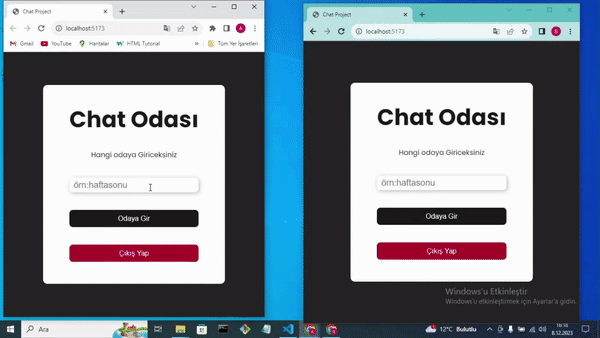

# MyChat

- Bu projede, veri depolama için localstorage kullandım, gerçek zamanlı iletişim için Firebase entegrasyonu uyguladım ve güvenli girişler için Kimlik Doğrulamayı kullandım. Kullanıcı erişimini yetkilendirme kontrolleriyle yönettim, böylece kullanıcı kolaylığını ve veri güvenliğini sağladım.

<h2>Screen Gif</h2>

